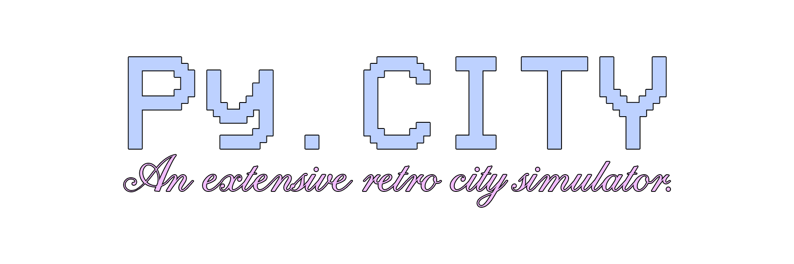

Py.City is a console video game based on both 1980s text adventures and the original SimCity by Maxis. This is a project from around June 2025, created as a final project for the CS Bridge.

## Features
* Fund management and public policy
* Zone construction and city expansion/planning
* Achievements
* Random events
* Sporadic elections for general game cycle
